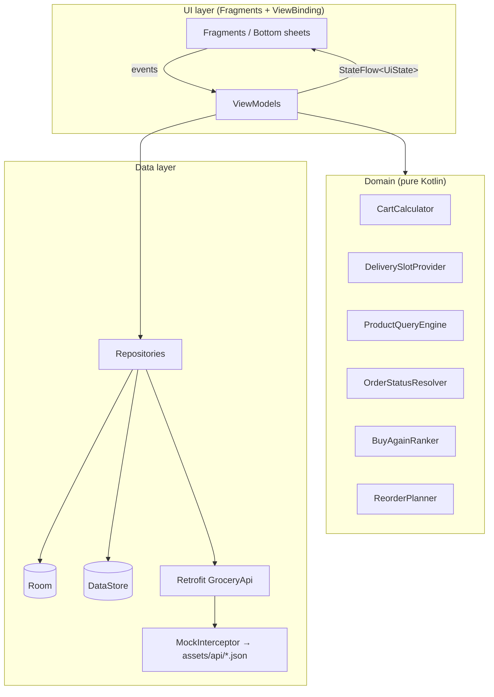
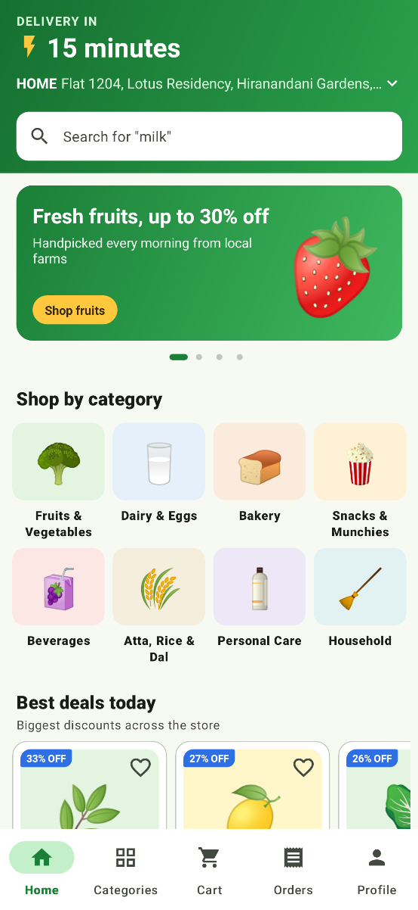
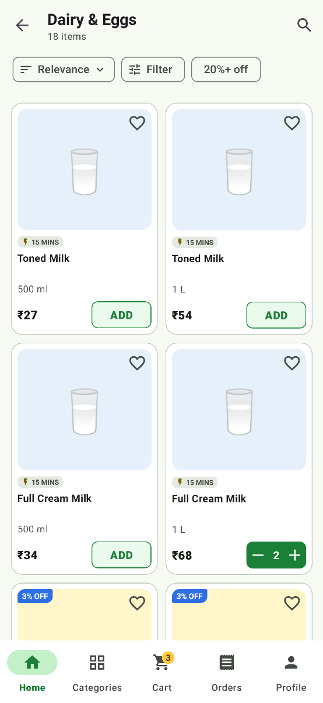
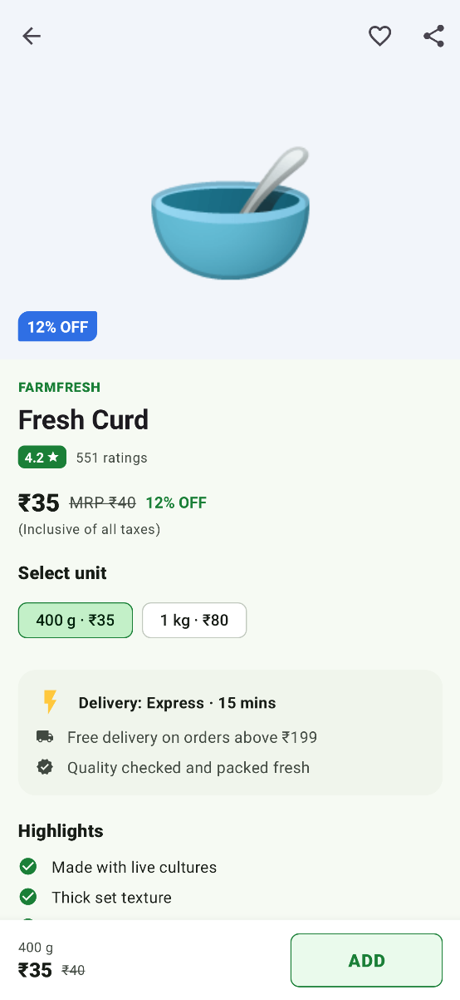
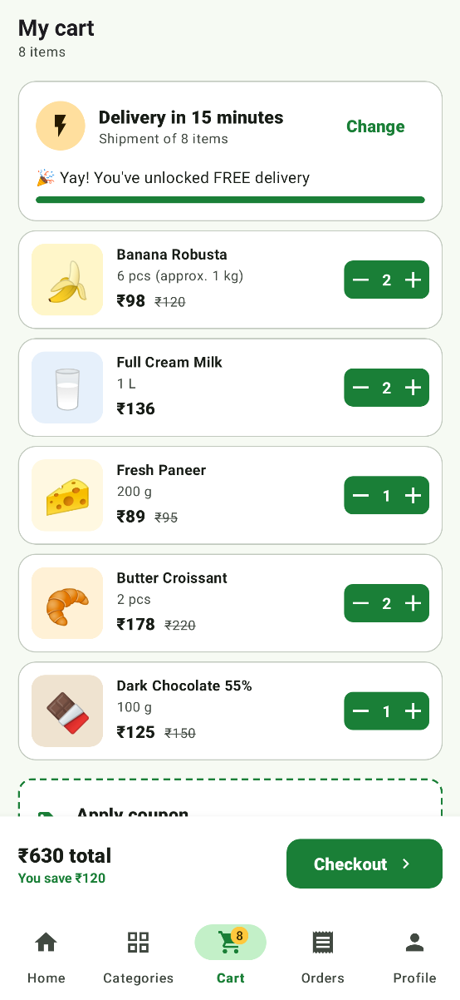
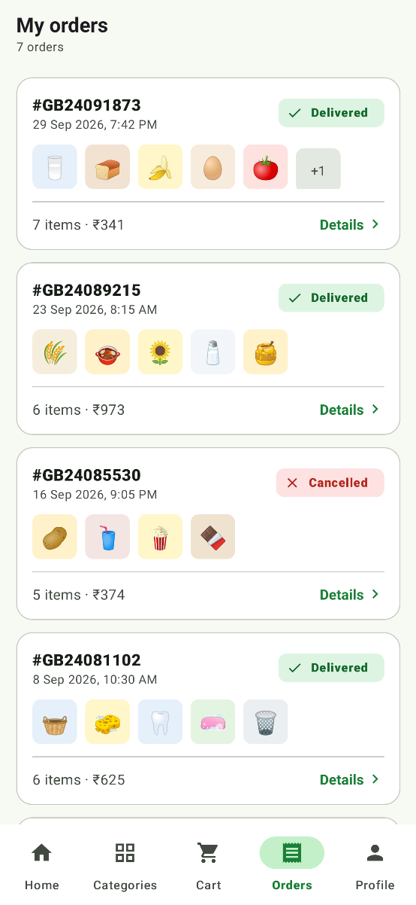
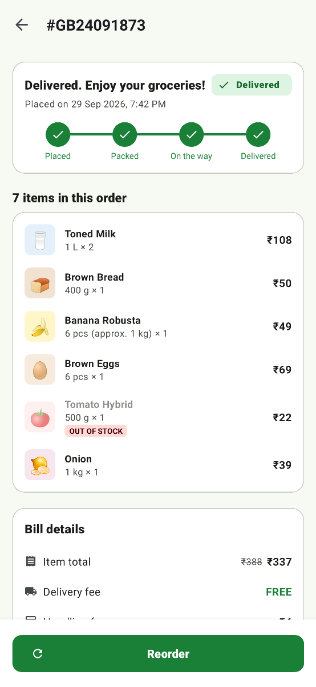
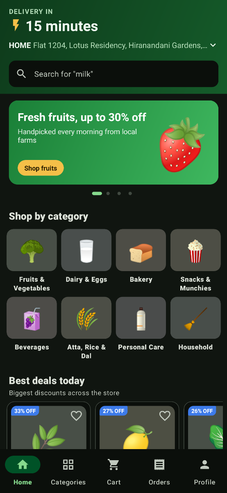
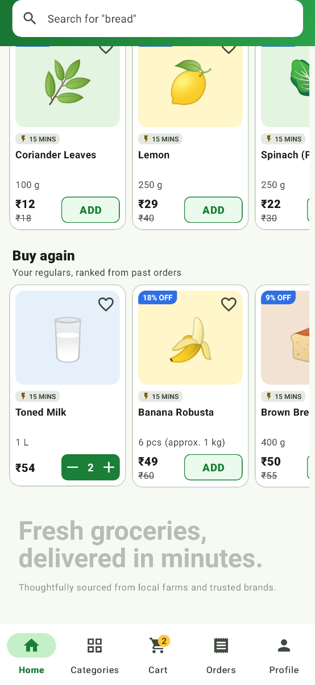
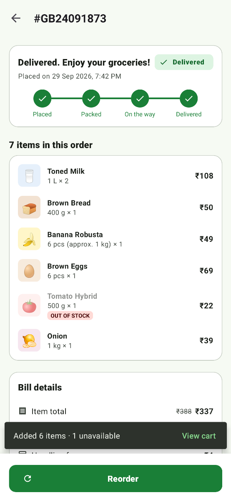

# GreenBasket 🥬

**A quick-commerce grocery app for Android — fresh produce, dairy and daily essentials with 15-minute express delivery or scheduled slots.**


GreenBasket intentionally showcases the **classic Android View system** — a single-Activity app built
with Fragments, the Navigation Component, ViewBinding, RecyclerView and Material Components — on top of
a modern, testable MVVM + Repository architecture. It runs completely offline: the "backend" is a
Retrofit service served by an OkHttp interceptor from bundled JSON.

## Features

- **Home** — delivery ETA + address header, rotating search hints, auto-scrolling offer banners
  (ViewPager2 + dot indicator), 8-category grid and a "Best deals today" carousel, all composed with a
  `ConcatAdapter`. Pull-to-refresh and a shimmer skeleton while the catalog loads.
- **Buy again** — a horizontal shelf on Home with up to 10 products you buy most often. A pure, unit-tested
  `BuyAgainRanker` scores each product by how many orders it appeared in, with every purchase weighted by
  recency (the weight halves every 14 days). Cancelled orders and sold-out products are left out, and ties
  are broken deterministically. Each card has the usual `ADD` / − n + stepper, and the shelf is hidden
  until there is order history.
- **Catalog** — 120 realistic products across Fruits & Vegetables, Dairy & Eggs, Bakery, Snacks,
  Beverages, Atta/Rice/Dal, Personal Care and Household, with MRP strike-through, % off and sold-out
  states.
- **Product listing** — 2-column grid, `ADD` button that morphs into a − n + stepper, sort & filter
  bottom sheet (relevance / price / discount / name, price range slider, minimum discount, brands) and
  a one-tap "20%+ off" quick filter.
- **Product detail** — collapsing image header, pack-size variants as chips, highlights, nutrition
  table, delivery info, similar products, wishlist and share, and a sticky add-to-cart bar.
- **Search** — debounced (`Flow.debounce`) live search, recent searches persisted in DataStore,
  trending suggestions and an empty state.
- **Cart** — Room-backed cart, quantity steppers, swipe-to-remove with *Undo*, free-delivery progress,
  coupons, delivery slot picker (express or one-hour windows today/tomorrow) and a full bill breakdown
  computed by a pure, unit-tested `CartCalculator` (item total, MRP savings, delivery fee free above
  ₹199, handling fee, coupon discount).
- **Checkout** — address and slot selection, payment method, order summary; the order is POSTed to the
  mock API and persisted locally.
- **Order placed** — animated checkmark (`AnimatedVectorDrawable`) with order summary.
- **Orders** — history with colour-coded status chips and order details with a live tracking timeline
  (status progresses over time for new orders).
- **Reorder** — one tap on an order's detail screen puts every item that is still available back in the cart
  at today's prices. A pure, unit-tested `ReorderPlanner` skips sold-out or delisted items (flagged
  *Out of stock* in the item list), merges with what is already in the cart up to the per-item limit, and a
  Snackbar sums it up ("Added 6 items · 1 unavailable") with a *View cart* action.
- **Profile** — saved addresses (add with validation, pick default), wishlist, savings stats,
  Light / Dark / System theme persisted in DataStore and applied via `AppCompatDelegate`.
- Material motion (`MaterialSharedAxis` for drill-down, `MaterialFadeThrough` between tabs), splash
  screen, adaptive launcher icon, edge-to-edge with proper insets, full light + dark palettes.

## Tech stack

| Layer | Libraries |
| --- | --- |
| Language | Kotlin 2.0, Coroutines, Flow / StateFlow |
| UI | XML layouts, ViewBinding, Fragments, Material Components 3, ConstraintLayout, CoordinatorLayout, CollapsingToolbarLayout, RecyclerView (`ListAdapter`, `DiffUtil`, `ConcatAdapter`), ViewPager2, SwipeRefreshLayout, BottomSheetDialogFragment |
| Navigation | Navigation Component (`nav_graph.xml`, `NavHostFragment`, `BottomNavigationView` + `NavigationUI`, multiple back stacks) |
| Architecture | MVVM, Repository pattern, unidirectional `UiState` + one-off events |
| DI | Hilt (`@HiltAndroidApp`, `@AndroidEntryPoint`, `@HiltViewModel`) |
| Persistence | Room (single source of truth), DataStore Preferences |
| Networking | Retrofit, OkHttp, Gson, custom `MockInterceptor` serving `assets/api/*.json` |
| Other | core-splashscreen, AnimatedVectorDrawable, custom `ShimmerLayout` and `QuantityStepperView` |
| Testing | JUnit 4, Truth, kotlinx-coroutines-test, Turbine, Robolectric + Roborazzi (screenshot tests), Hilt testing |

## Architecture



- **Room is the single source of truth.** On first launch (or pull-to-refresh) the repository fetches
  categories, products and banners from the API and caches them; every screen observes Room via Flow.
- ViewModels combine repository flows into immutable `UiState` objects exposed as `StateFlow` and
  collected in Fragments with `repeatOnLifecycle(STARTED)`.
- Business rules (pricing, delivery slots, sort/filter, order progress, address validation, buy-again
  ranking, re-order planning) live in pure Kotlin classes so they can be unit tested without Android.

## Package structure

```
io.github.ieswar23.greenbasket
├── data
│   ├── local          # Room database, entities, DAOs, type converters
│   ├── preferences    # DataStore-backed PreferencesRepository
│   ├── remote         # Retrofit API, DTOs, MockInterceptor
│   ├── repository     # Catalog, Cart, Wishlist, Address and Order repositories
│   └── Mappers.kt     # DTO ⇄ entity ⇄ domain mapping
├── di                 # Hilt modules (app, database, network, repositories)
├── domain
│   ├── model          # Product, CartItem, Bill, Coupon, DeliverySlot, Order, Address…
│   ├── CartCalculator.kt, CouponCatalog.kt, DeliverySlotProvider.kt
│   ├── ProductQueryEngine.kt, OrderStatusResolver.kt, AddressValidator.kt
│   ├── BuyAgainRanker.kt, ReorderPlanner.kt
├── ui
│   ├── common         # ProductAdapter, QuantityStepperView, ShimmerLayout, BillBinder, extensions
│   ├── home           # HomeFragment + ConcatAdapter sections
│   ├── categories
│   ├── productlist    # Listing + sort/filter bottom sheet
│   ├── detail
│   ├── search
│   ├── cart           # Cart, slot picker and coupon sheets
│   ├── checkout       # Checkout + order placed
│   ├── orders         # History + order detail
│   ├── profile        # Profile + address book sheet
│   └── wishlist
├── util               # Formatting, time provider
├── GreenBasketApp.kt
└── MainActivity.kt
```

## Getting started

1. Install **Android Studio Ladybug (2024.2.1) or newer** with **JDK 17**.
2. Clone the repository and open the project folder in Android Studio.
3. Let Gradle sync, then run the `app` configuration on an emulator or device (Android 7.0+).

No API keys or backend are required — all data is bundled and served through the mock interceptor.

From the command line:

```bash
./gradlew assembleDebug
```

## Testing

```bash
./gradlew testDebugUnitTest
```

64 unit tests cover:

- `CartCalculator` — item totals, MRP savings, free-delivery threshold, handling fee, flat and
  percentage coupons (minimum order, caps).
- `CartViewModel` — bill state, undoable removal, coupon apply / shortfall / invalid / remove (with fake
  repositories and Turbine).
- `ProductListViewModel` — sorting by price / discount, brand + discount + price filters, facet
  options, empty state and cart quantities.
- `SearchViewModel` — debounce behaviour driven by a `StandardTestDispatcher` and virtual time, minimum
  query length, empty results and recent searches.
- `BuyAgainRanker` — frequency × recency scoring, cancelled / sold-out / delisted exclusion, deterministic
  tie-breaking and the 10-item cap, driven by an injected clock.
- `ReorderPlanner` — fully available orders, skipping out-of-stock and delisted items, merging with
  quantities already in the cart, merging duplicate lines and capping at the per-item cart limit.
- `HomeViewModel` and `OrderDetailViewModel` — the Buy again shelf reacting to order history, stock and cart
  changes, and *Reorder* filling the cart and reporting what it skipped.
- Delivery slot generation, simulated order status progression, address validation and recent-search
  merging.

### Screenshot tests

`ScreenshotTest` launches the real `MainActivity` on the JVM with Robolectric native graphics, using
the production Hilt graph (`HiltTestApplication`), Room and the mock Retrofit API. It navigates to each
screen with the `NavController` and captures it with [Roborazzi](https://github.com/takahirom/roborazzi).
A plain `testDebugUnitTest` run renders every screen, so a crash fails the build, but it doesn't write
any images. To regenerate the PNGs in `docs/screenshots/`, run:

```bash
./gradlew recordRoborazziDebug
```

## Screenshots

<table>
  <tr>
    <td align="center"><br/><sub>Home: banners, categories, deals</sub></td>
    <td align="center"><br/><sub>Product listing with sort and filters</sub></td>
    <td align="center"><br/><sub>Product detail with pack sizes</sub></td>
  </tr>
  <tr>
    <td align="center"><br/><sub>Cart, delivery slot and steppers</sub></td>
    <td align="center"><br/><sub>Order history</sub></td>
    <td align="center"><br/><sub>Order tracking timeline</sub></td>
  </tr>
  <tr>
    <td align="center"><br/><sub>Dark theme</sub></td>
    <td align="center"><br/><sub>Buy again, ranked from order history</sub></td>
    <td align="center"><br/><sub>Reorder with skipped items summary</sub></td>
  </tr>
</table>

## Roadmap

- Paginate large categories with Paging 3 and a real backend behind the existing repository interfaces.
- Live order tracking with a map view and push notifications via WorkManager.
- Instrumented UI tests (Espresso) for the cart and checkout flows.
- Multi-language support (Hindi, Tamil, Telugu) and accessibility audits with TalkBack.

## License

Released under the [MIT License](LICENSE). All brands, products and prices in the app are fictional.

## Author

**Eswar Reddy Madhira** — Android Developer

[](https://www.linkedin.com/in/eswar-reddy-android)
[](https://github.com/iEswar23)
